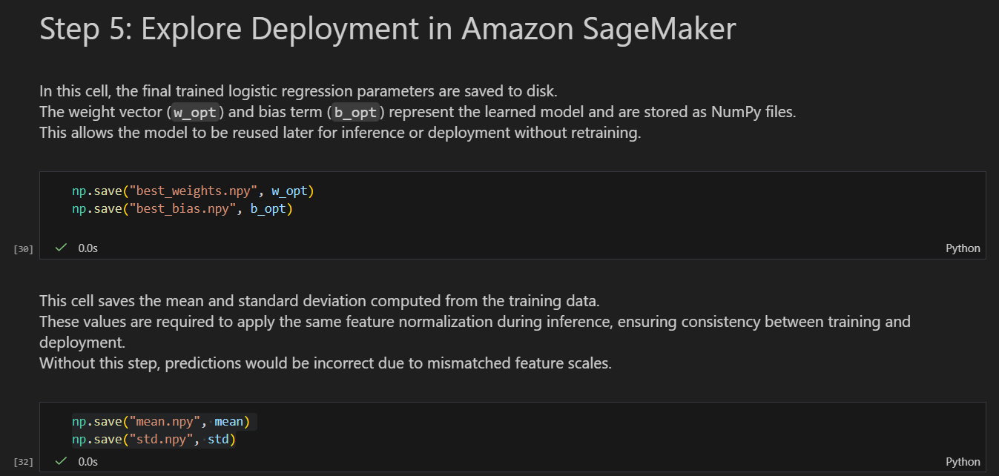
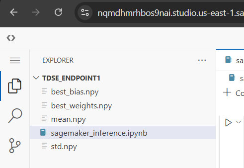
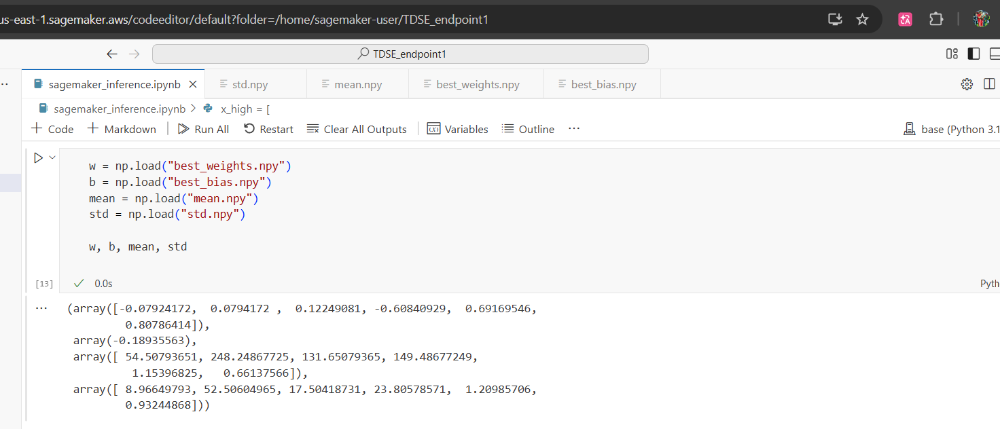
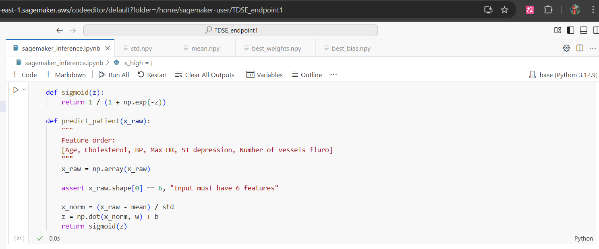
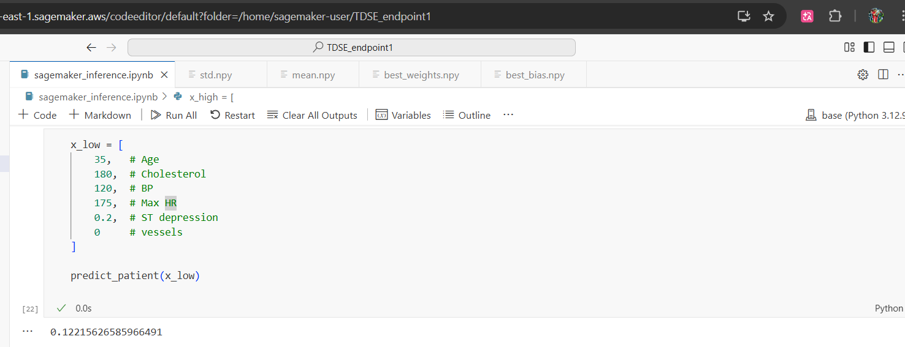
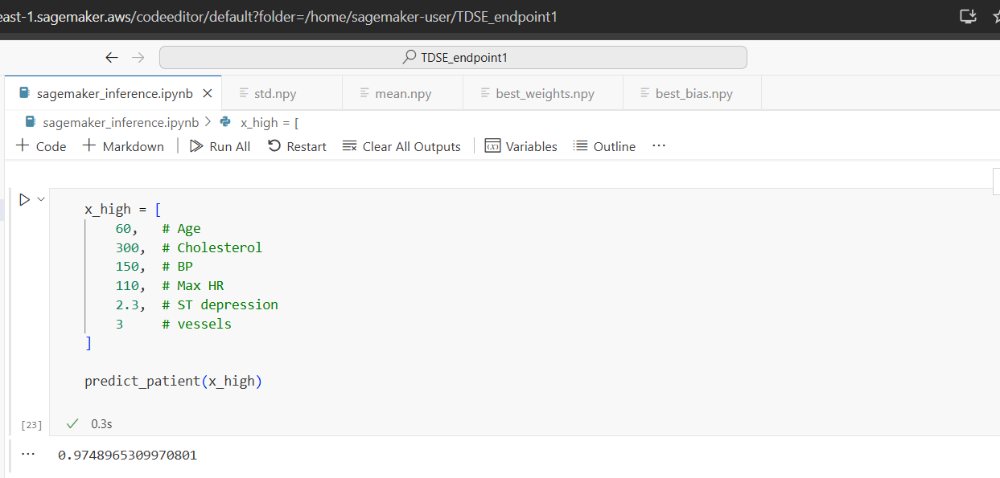

# TDSE - Heart Disease Risk Prediction using Logistic Regression

## Student name: Santiago Amaya Zapata

## Exercise Summary
This project implements a logistic regression model from scratch to predict heart disease risk based on clinical data.  
The workflow includes exploratory data analysis (EDA), model training, decision boundary visualization, L2 regularization, and an exploration of deployment using Amazon SageMaker.

---

## Introductory Context
Heart disease is the world’s leading cause of death, accounting for approximately 18 million deaths per year according to the World Health Organization.  
Machine learning models such as logistic regression can help identify high-risk patients early by analyzing medical features like age, cholesterol, blood pressure, and heart rate.  

In this assignment, a logistic regression model is built without using high-level ML libraries, focusing on understanding the underlying mathematics and implementation details.

---

## Dataset Description
- **Source:** Kaggle – Heart Disease Dataset  
  https://www.kaggle.com/datasets/neurocipher/heartdisease
- **Records:** 303 patients  
- **Target:** Binary classification  
  - `1` → Presence of heart disease  
  - `0` → Absence of heart disease  
- **Selected Features:**
  - Age
  - Cholesterol
  - Blood Pressure (BP)
  - Maximum Heart Rate (Max HR)
  - ST Depression
  - Number of vessels fluro
- **Disease prevalence:** ~55%

---

## Step 1: Data Loading and Preparation
- Dataset loaded using Pandas and target variable binarized.
- Exploratory Data Analysis (EDA) performed using summary statistics and data inspection.
- Outliers analyzed using the Interquartile Range (IQR) method.
- Data split into **70% training / 30% testing**, stratified by class.
- Numerical features normalized using training set mean and standard deviation.

---

## Step 2: Logistic Regression Implementation
- Implemented from scratch using NumPy:
  - Sigmoid function
  - Binary cross-entropy loss
  - Gradient descent optimization
- Model trained for 1000 iterations with learning rate α = 0.01.
- Training convergence analyzed using cost vs. iteration plots.
- Model evaluated using:
  - Accuracy
  - Precision
  - Recall
  - F1-score  
- Metrics reported for both training and test sets.

---

## Step 3: Decision Boundary Visualization
- Logistic regression trained on 2D feature pairs.
- Decision boundaries visualized for:
  - Age vs. Cholesterol
  - Blood Pressure vs. Max Heart Rate
  - ST Depression vs. Number of Vessels
- Scatter plots colored by true class labels.
- Each plot analyzed to discuss linear separability and feature interaction.

---

## Step 4: Regularization (L2)
- L2 regularization added to:
  - Cost function
  - Gradient updates
- Tested multiple λ values:  
  `[0, 0.001, 0.01, 0.1, 1]`
- Compared:
  - Training vs. test performance
  - Weight norms (‖w‖)
- Visual comparison between regularized and unregularized models.
- Optimal λ = 0.1 selected based on generalization performance.

---

## Step 5: Deployment with Amazon SageMaker

**High-level steps performed:**
- Exported trained model parameters (weights, bias, normalization values).

- Created a SageMaker notebook instance using the free tier. Uploaded model artifacts and inference code.

- Load trained model parameters

This cell loads the trained logistic regression model parameters and normalization statistics saved previously.  
The weights (`w`) and bias (`b`) define the learned model, while `mean` and `std` are required to normalize new input data in the same way as during training.

- Define inference functions

This cell defines the functions required for inference.  
The `sigmoid` function converts the linear output into a probability between 0 and 1.  
The `predict_patient` function takes raw patient features, checks the correct feature order and size, normalizes the input using the training mean and standard deviation, and returns the predicted probability of heart disease.

- Low-risk patient example

This cell tests the deployed model with a low-risk patient profile.  
The input represents a young patient with normal cholesterol, blood pressure, high maximum heart rate, minimal ST depression, and no affected vessels.  
The resulting probability is expected to be low, indicating a low risk of heart disease.

- High-risk patient example

This cell evaluates the model using a high-risk patient profile.  
The input corresponds to an older patient with high cholesterol, elevated blood pressure, low maximum heart rate, significant ST depression, and multiple affected vessels.  
The predicted probability is expected to be high, indicating a high risk of heart disease.

**Commentary:**
- Describe how deployment enables real-time heart disease risk scoring.
- Mention observed latency and potential production use cases.

---

## Deliverables
- Jupyter Notebook with full implementation and explanations
- README.md with project overview and results
- Visualizations and tables
- Amazon SageMaker deployment evidence

---

## Final Notes
This project emphasizes understanding logistic regression at a low level, model interpretability, and the transition from experimentation to deployment in a cloud environment.
